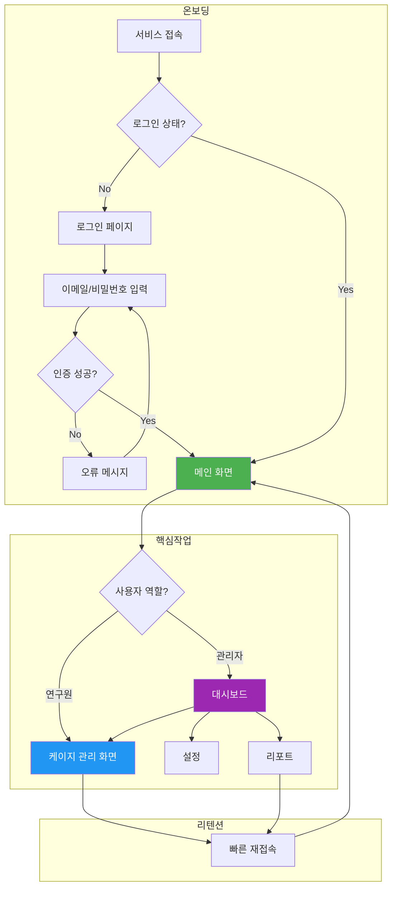
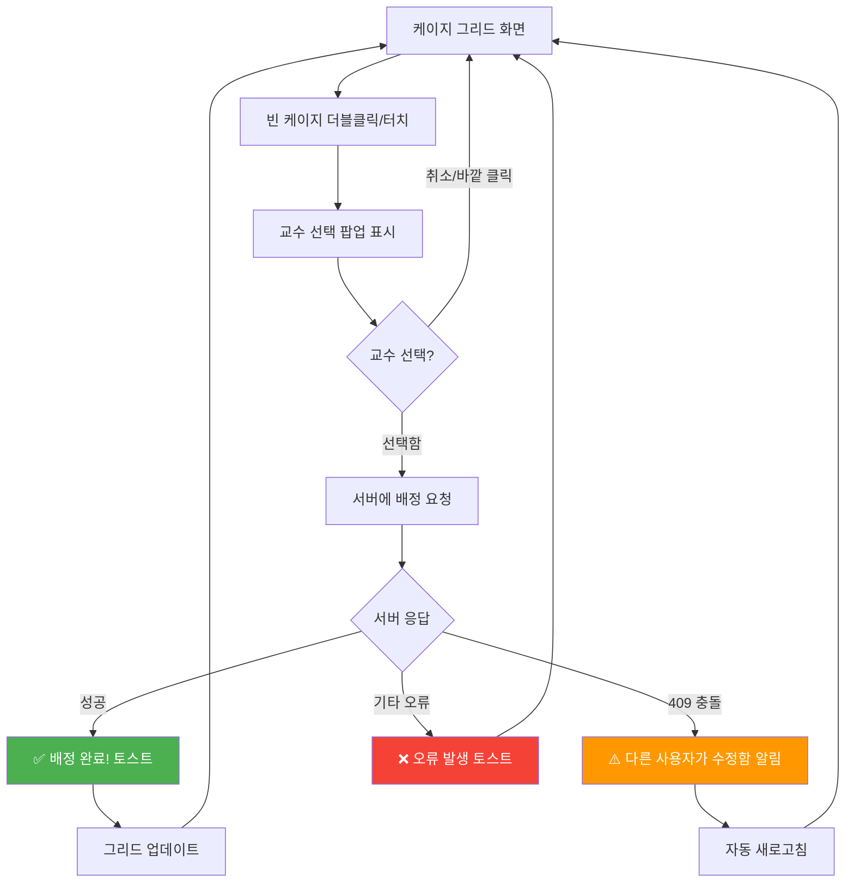
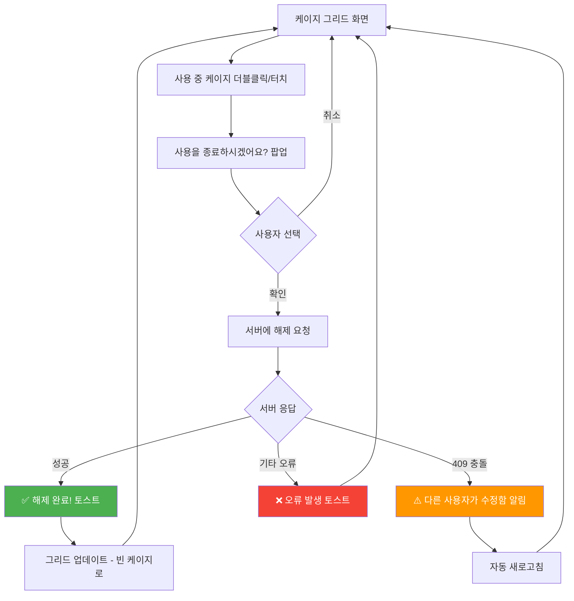
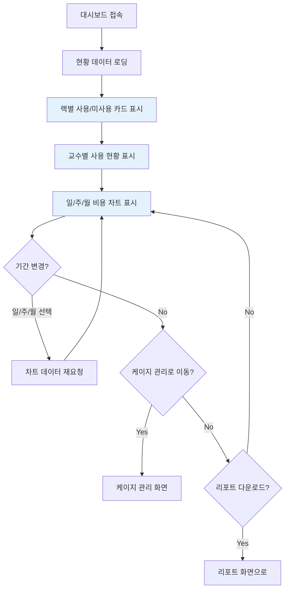
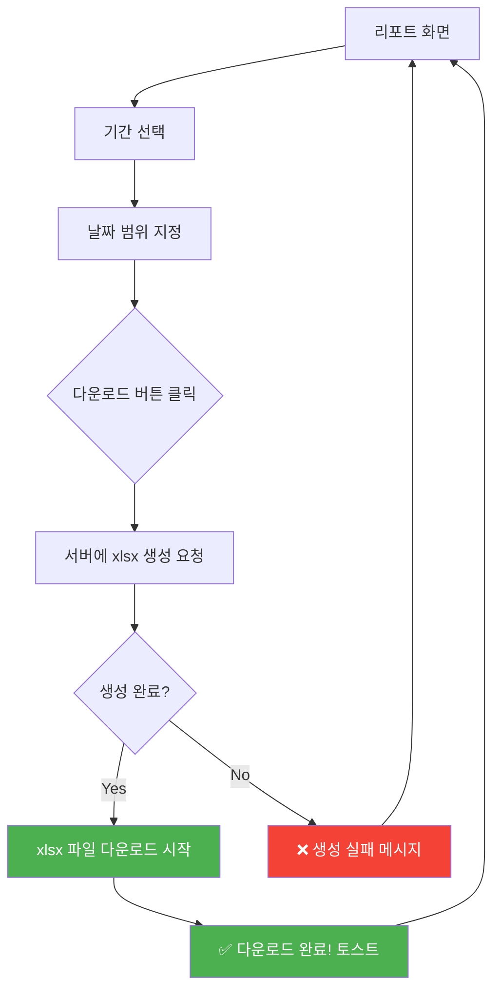
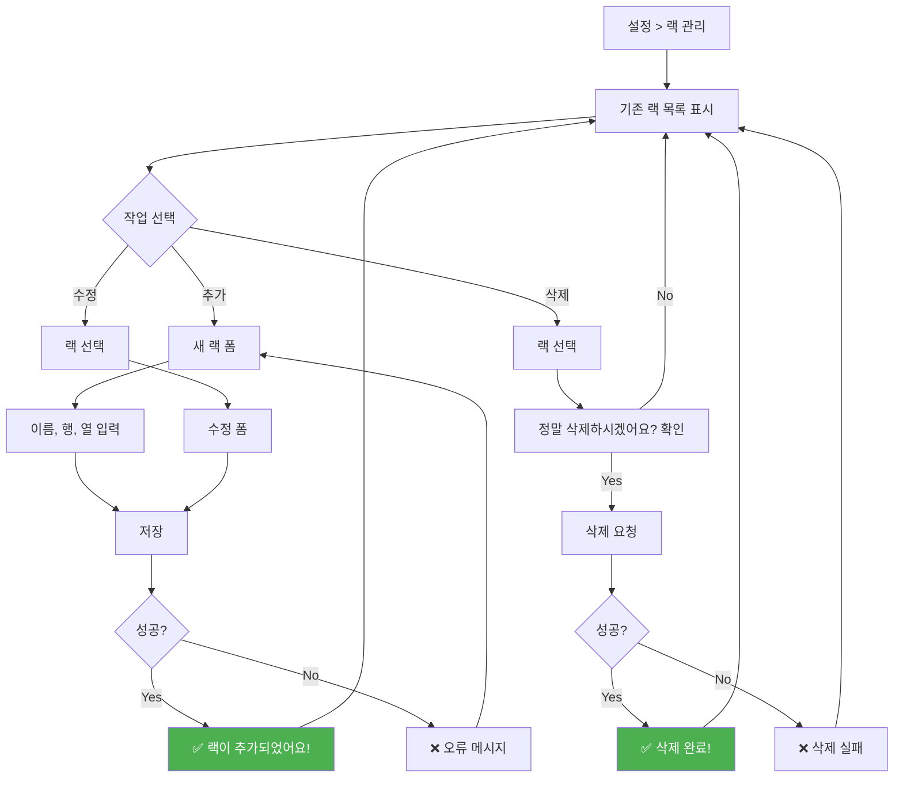
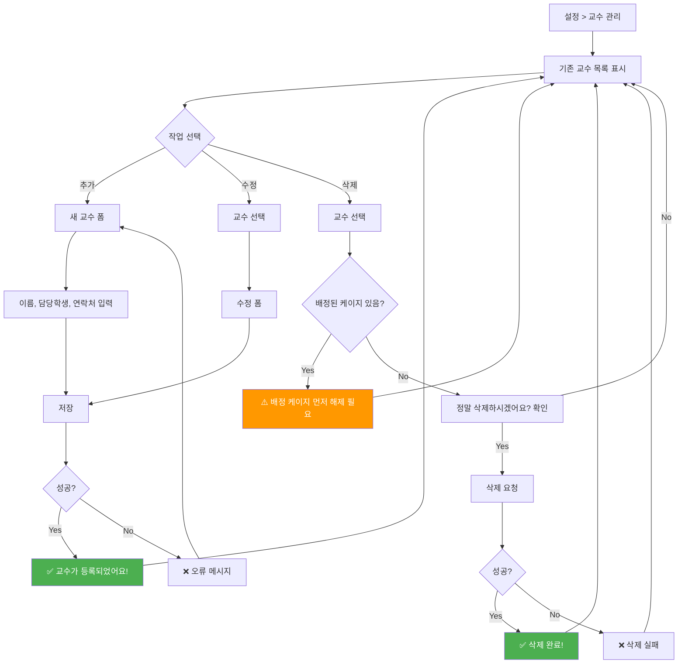
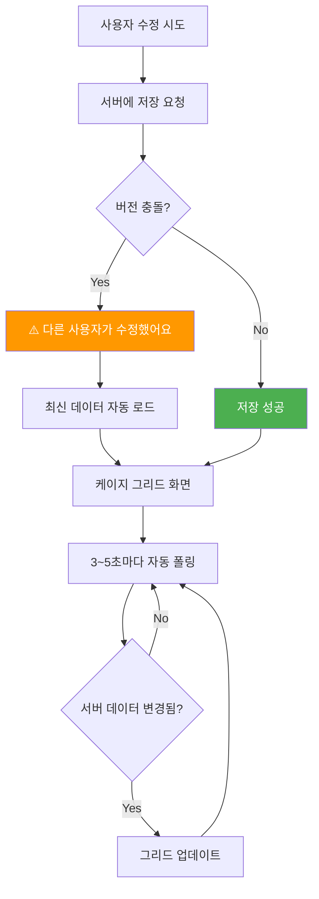
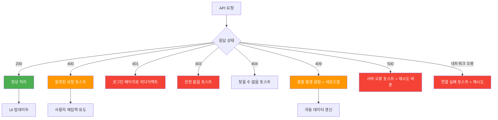

# User Flow: 연구실 케이지 관리 서비스

> **문서 버전**: v1.0  
> **작성일**: 2026-01-18  
> **상태**: 초안

---

## 1. 전체 사용자 여정

---

## 2. FEAT-1: 케이지 배정 흐름

### 2.1 빈 케이지 → 교수 배정

### 2.2 사용 중 케이지 → 해제

---

## 3. FEAT-2: 대시보드 조회 흐름

---

## 4. FEAT-3: 리포트 다운로드 흐름

---

## 5. 설정: 랙 관리 흐름

---

## 6. 설정: 교수 관리 흐름

---

## 7. 충돌 감지 및 자동 폴링

---

## 8. 에러 처리 흐름

