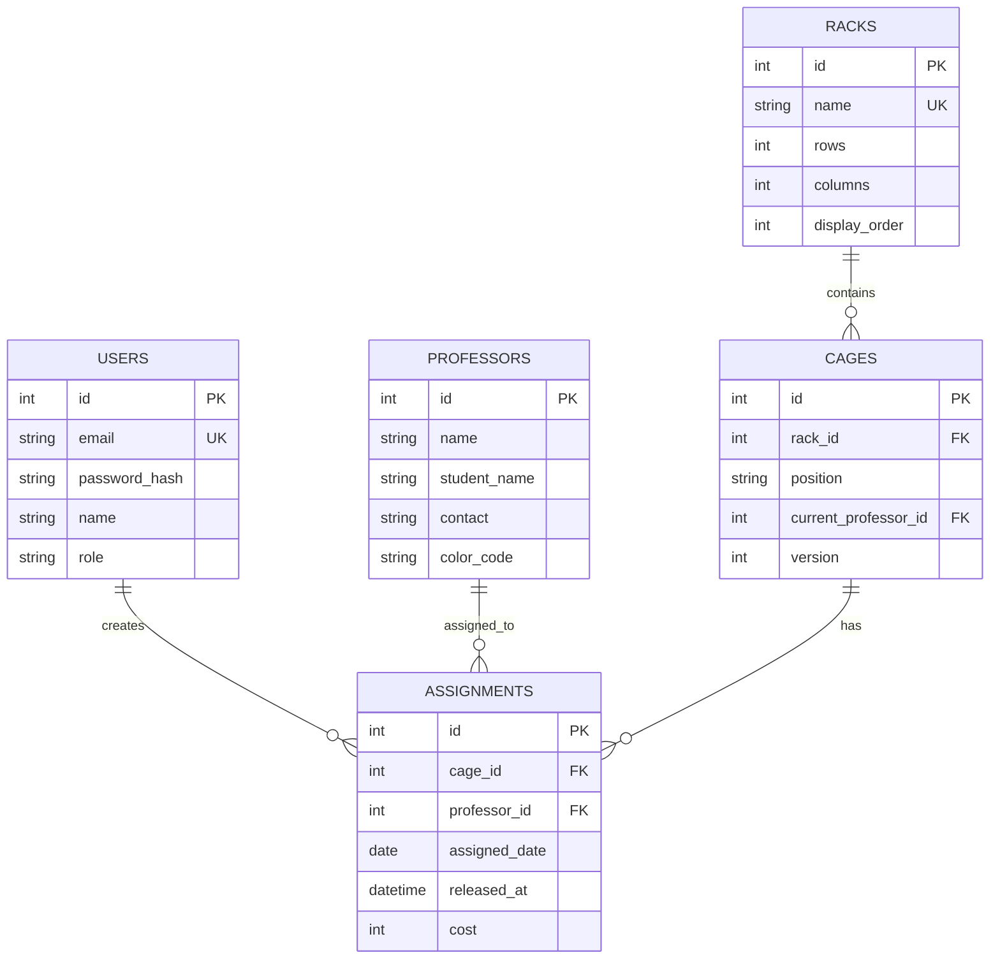

# Database Design: 연구실 케이지 관리 서비스

> **문서 버전**: v1.1 | **작성일**: 2026-01-18 | **최종 수정**: 2026-01-18

---

## 1. ERD

---

## 2. 테이블 명세

### 2.1 users
| 컬럼 | 타입 | 설명 |
|------|------|------|
| id | INTEGER PK | 기본키 |
| email | VARCHAR(255) UNIQUE | 로그인 이메일 |
| password_hash | VARCHAR(255) | bcrypt 해시 |
| name | VARCHAR(100) | 표시 이름 |
| role | VARCHAR(20) | admin/researcher |
| created_at, updated_at, deleted_at | DATETIME | 타임스탬프 |

### 2.2 racks
| 컬럼 | 타입 | 설명 |
|------|------|------|
| id | INTEGER PK | 기본키 |
| name | VARCHAR(100) UNIQUE | 랙 이름 |
| rows | INTEGER | 행 수 |
| columns | INTEGER | 열 수 |
| display_order | INTEGER | 탭 순서 |

### 2.3 professors
| 컬럼 | 타입 | 설명 |
|------|------|------|
| id | INTEGER PK | 기본키 |
| name | VARCHAR(100) | 교수 이름 |
| student_name | VARCHAR(100) | 담당 학생 |
| contact | VARCHAR(50) | 연락처 |
| color_code | VARCHAR(7) | UI 색상 (HEX) |

### 2.4 cages
| 컬럼 | 타입 | 설명 |
|------|------|------|
| id | INTEGER PK | 기본키 |
| rack_id | INTEGER FK | 소속 랙 |
| position | VARCHAR(10) | 위치 (A1, B2) |
| row_index, col_index | INTEGER | 그리드 좌표 |
| current_professor_id | INTEGER FK NULL | 현재 배정 교수 |
| version | INTEGER DEFAULT 1 | Optimistic Lock |

### 2.5 assignments
| 컬럼 | 타입 | 설명 |
|------|------|------|
| id | INTEGER PK | 기본키 |
| cage_id | INTEGER FK | 케이지 |
| professor_id | INTEGER FK | 배정된 교수 |
| assigned_by_user_id | INTEGER FK | 배정자 |
| assigned_date | DATE | 과금 기준일 |
| assigned_at | DATETIME | 배정 시각 |
| released_at | DATETIME NULL | 해제 시각 |
| cost | INTEGER DEFAULT 800 | 일일 비용 |

---

## 3. 인덱스

| 테이블 | 인덱스 | 용도 |
|--------|--------|------|
| cages | (rack_id, row_index, col_index) UNIQUE | 랙별 케이지 조회 |
| assignments | (cage_id, assigned_date) | 케이지별 이력 |
| assignments | (professor_id, assigned_date) | 교수별 이력 |
| assignments | (assigned_date) | 일별 리포트 |

---

## 4. 관계 및 Cascade 설정

| 부모 테이블 | 자식 테이블 | 관계 | Cascade |
|-------------|-------------|------|---------|
| racks | cages | 1:N | `all, delete-orphan` (랙 삭제 시 케이지도 삭제) |
| cages | assignments | 1:N | `all, delete-orphan` (케이지 삭제 시 배정 기록도 삭제) |
| professors | cages | 1:N | None (교수 삭제 시 케이지의 `current_professor_id` = NULL) |
| professors | assignments | 1:N | None (교수 삭제 시 배정 기록 유지) |
| users | assignments | 1:N | None (사용자 삭제 시 배정 기록 유지) |

### 4.1 삭제 규칙

| 엔티티 | 삭제 조건 |
|--------|-----------|
| **랙** | 배정된 케이지가 없을 때만 삭제 가능 |
| **교수** | 배정된 케이지가 없을 때만 삭제 가능 (예정) |
| **케이지** | 랙과 함께 cascade 삭제 |

---

## 5. 과금 규칙

- **일일 과금**: 케이지 1개당 800원
- **다중 사용**: 같은 날 A→B 순차 사용 시, A와 B 모두 청구
- **시점**: 배정 시점에 과금 확정
